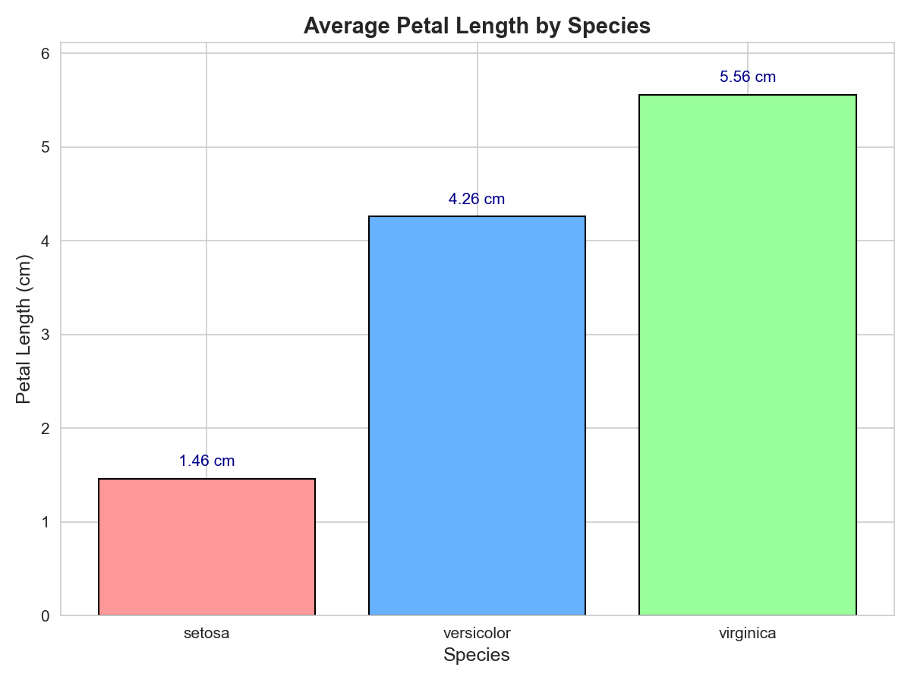

# Data Analysis Assignment

This project analyzes the **Iris dataset** using:
- 🐼 Pandas for data loading and analysis
- 📊 Matplotlib for visualization
- 🧪 Scikit-learn for dataset access

## Files Included
- `data_analysis_assignment.py` – Main script
- `requirements.txt` – Required packages
- `plots/` – Saved visualizations

## How to Run
1. Create virtual environment:  
   `python -m venv venv`
2. Activate it:  
   `venv\Scripts\Activate`
3. Install dependencies:  
   `pip install -r requirements.txt`
4. Run the script:  
   `python data_analysis_assignment.py`

## Visualizations

